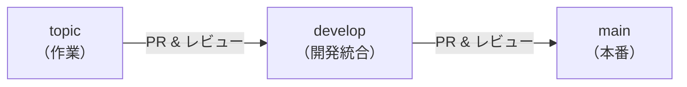

# 🌿 ブランチ運用ルール

本 Ops Kit で設定されるブランチ保護ルール（Rulesets）と、ブランチ戦略について説明します。

<!-- START doctoc generated TOC please keep comment here to allow auto update -->
<!-- DON'T EDIT THIS SECTION, INSTEAD RE-RUN doctoc TO UPDATE -->

（ここをクリック）目次
<ul>
<li><a href="#-ブランチ戦略の概要">🔀 ブランチ戦略の概要</a></li>

<li><a href="#-ruleset-の定義内容">🛡️ Ruleset の定義内容</a></li>

<li><a href="#-github-プランによる制限事項">⚠️ GitHub プランによる制限事項</a></li>

<li><a href="#-workflow-06-との関連">🔗 Workflow 06 との関連</a></li>
</ul>

<!-- END doctoc generated TOC please keep comment here to allow auto update -->

---

## 🔀 ブランチ戦略の概要

本キットでは、以下の**3**種類のブランチを想定した運用戦略を採用しています。

| ブランチ | 命名規則 | 役割 |
|---------|---------|------|
| **main** | `main` | 本番リリース用のブランチ。常にデプロイ可能な状態を維持する |
| **develop** | `develop` | 開発統合用のブランチ。各トピックブランチの変更をまとめる |
| **topic** | `feature/*`, `hotfix/*`, `release/*`, `issues/*` | 個別の機能追加・修正・リリース準備を行う作業ブランチ |

### 各ブランチの運用ポイント

- **main**: 直接コミットは禁止。必ず PR 経由でマージする
- **develop**: main と同様に PR 経由でのマージを必須とする
- **topic**: 作業が完了したら develop（または main）へ PR を作成する。force push や削除は禁止

---

## 🛡️ Ruleset の定義内容

`scripts/config/repo-ruleset-definitions.json` で、以下の**3**つの Ruleset が定義されています。

### main branch protection

main ブランチに対する保護ルールです。

| ルール | 設定値 | 説明 |
|--------|--------|------|
| **PR レビュー必須** | 承認 1 名以上 | マージには最低 1 名のレビュー承認が必要 |
| **stale review の自動却下** | 有効 | 新しいコミットが push されると、既存の承認を自動で却下する |
| **non-fast-forward 禁止** | 有効 | 履歴の書き換え（force push）を禁止する |
| **削除禁止** | 有効 | ブランチの削除を禁止する |

> **補足**: Code Owner レビュー、最終 push 者の承認、レビュースレッドの解決は必須としていません。マージ方法は merge・squash・rebase のいずれも許可されています。

### develop branch protection

develop ブランチに対する保護ルールです。main branch protection と同一の設定です。

| ルール | 設定値 | 説明 |
|--------|--------|------|
| **PR レビュー必須** | 承認 1 名以上 | マージには最低 1 名のレビュー承認が必要 |
| **stale review の自動却下** | 有効 | 新しいコミットが push されると、既存の承認を自動で却下する |
| **non-fast-forward 禁止** | 有効 | 履歴の書き換え（force push）を禁止する |
| **削除禁止** | 有効 | ブランチの削除を禁止する |

### topic branch protection

`feature/*`、`hotfix/*`、`release/*`、`issues/*` ブランチに対する保護ルールです。

| ルール | 設定値 | 説明 |
|--------|--------|------|
| **non-fast-forward 禁止** | 有効 | 履歴の書き換え（force push）を禁止する |
| **削除禁止** | 有効 | ブランチの削除を禁止する |

> **補足**: トピックブランチでは PR レビューは必須としていません。履歴の保全と誤削除防止に焦点を当てたルールです。

---

## ⚠️ GitHub プランによる制限事項

Rulesets の動作は GitHub のプランによって異なります。

| プラン | enforcement: `active` の動作 |
|--------|------------------------------|
| **Free**（個人アカウント） | `evaluate` モード相当として扱われる。ルール違反はログに記録されるが、**ブロックはされない** |
| **Free**（Organization） | `evaluate` モード相当として扱われる。ルール違反はログに記録されるが、**ブロックはされない** |
| **Team / Enterprise** | `active` モードとして完全に機能する。ルール違反は**ブロックされる** |

> **注意**: Free プランでは Ruleset を作成しても実質的にルールが強制されません。ルールを強制したい場合は、Team プラン以上へのアップグレードを検討してください。

---

## 🔗 Workflow 06 との関連

ブランチ保護ルールは、**⑥ Ruleset 一括作成**（`.github/workflows/06-setup-repository-rulesets.yml`）を実行することで対象リポジトリに一括作成されます。

### 実行方法

1. GitHub Actions の `workflow_dispatch` から手動実行する
2. 入力パラメータとして `target_repo`（`owner/repo` 形式）を指定する
3. ワークフローが `scripts/config/repo-ruleset-definitions.json` を読み取り、定義されている 3 つの Ruleset を GitHub API 経由で作成する

### 前提条件

- `PROJECT_PAT` シークレットに、対象リポジトリの Ruleset を管理する権限を持つ Personal Access Token が設定されていること
