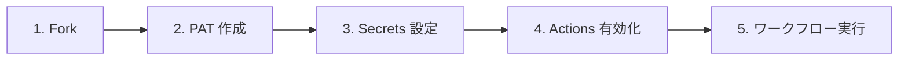

# 📖 GitHub Projects Starter Kit ドキュメント

`GitHub Projects` の初期セットアップを `GitHub Actions` で自動実行するための **スターターキット** です。

<!-- START doctoc generated TOC please keep comment here to allow auto update -->
<!-- END doctoc generated TOC please keep comment here to allow auto update -->

---

## 🚀 はじめての方へ

`GitHub Projects` を使ったプロジェクト管理をすぐに始められます。以下のステップで進めてください。

### 🖱️ GUI で進める方（おすすめ）

GitHub の画面操作だけでセットアップできます。コマンド操作は不要です。

→ [GUI クイックスタート](quickstart-gui)

### ⌨️ CLI で進める方（上級者向け）

`gh` CLI を使ってターミナルから操作します。生成 AI へのヒントとしても活用できます。

→ [CLI クイックスタート](quickstart-cli)

---

## 📋 やりたいこと別ガイド

| やりたいこと | ワークフロー | 説明 |
|-------------|-------------|------|
| 新しく Project を作りたい | [① GitHub Project 新規作成](workflows/01-create-project) | `Project` の作成・フィールド・ステータス・View を一括セットアップ |
| 既存の Project を整えたい | [② GitHub Project 拡張](workflows/02-extend-project) | 既存 `Project` にフィールド・ステータス・View を追加 |
| リポジトリにラベルを一括追加したい | [③ Issue ラベル一括追加](workflows/03-setup-repository-labels) | 設定ファイルで定義したラベルをリポジトリに一括作成 |
| Issue/PR をまとめて取り込みたい | [④ Issue/PR 一括紐付け](workflows/04-add-items-to-project) | リポジトリの `Issue`/`PR` を `Project` に一括追加 |
| Project の内容を一覧で出したい | [⑤ 統合プロジェクト分析](workflows/05-analyze-project) | `Project` の `Issue`/`PR` 一覧をエクスポート（`report_types: export`） |
| プロジェクトを分析したい | [⑤ 統合プロジェクト分析](workflows/05-analyze-project) | 滞留検知・サマリー・工数集計・エクスポートをまとめて、または個別に実行 |

---

## 🔧 困ったときは

| 状況 | 参照先 |
|------|--------|
| エラーが出る・動かない | [トラブルシューティング](troubleshooting) |
| よくある質問を確認したい | [FAQ](faq) |

---

## 📚 詳しく知りたい方へ

| トピック | 説明 |
|---------|------|
| [認証・トークンガイド](guide/auth-tokens) | PAT の権限設定、Fine-grained / Classic token の選び方 |
| [入力値ガイド](guide/input-values) | `project_number`・`target_repo` などの確認方法 |
| [運用ルール](guide/kanban-rules) | カンバンフロー、カスタムフィールド、View 構成 |
| [ラベル運用ルール](guide/label-rules) | Issue ラベルのカテゴリ分類、用途、付与タイミング |
| [アーティファクトの手動削除](guide/delete-artifacts) | ワークフローで生成されたアーティファクトの削除手順（GUI / CLI） |
| [用語集](glossary) | GitHub 関連の専門用語の解説 |

---

## 👨‍💻 開発者向け

ワークフローの内部構成やスクリプトの詳細については [開発者向けドキュメント](developers) をご参照ください。

---

## 🏠 リポジトリ

- GitHub: [mabubu0203/github-projects-starter-kit](https://github.com/mabubu0203/github-projects-starter-kit)
