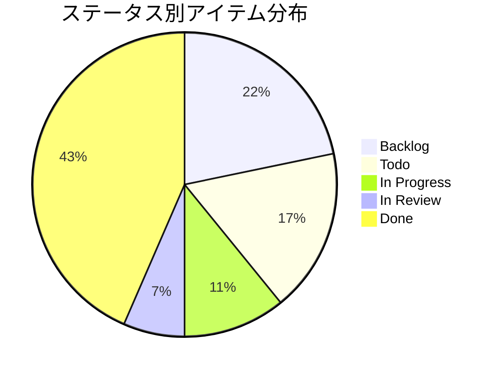
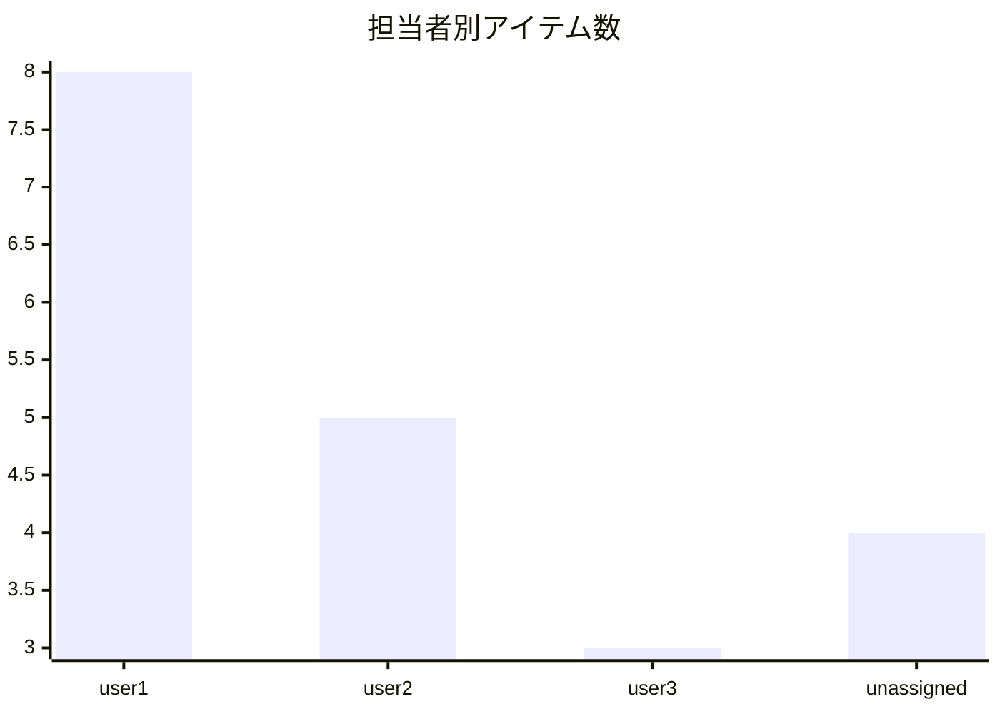
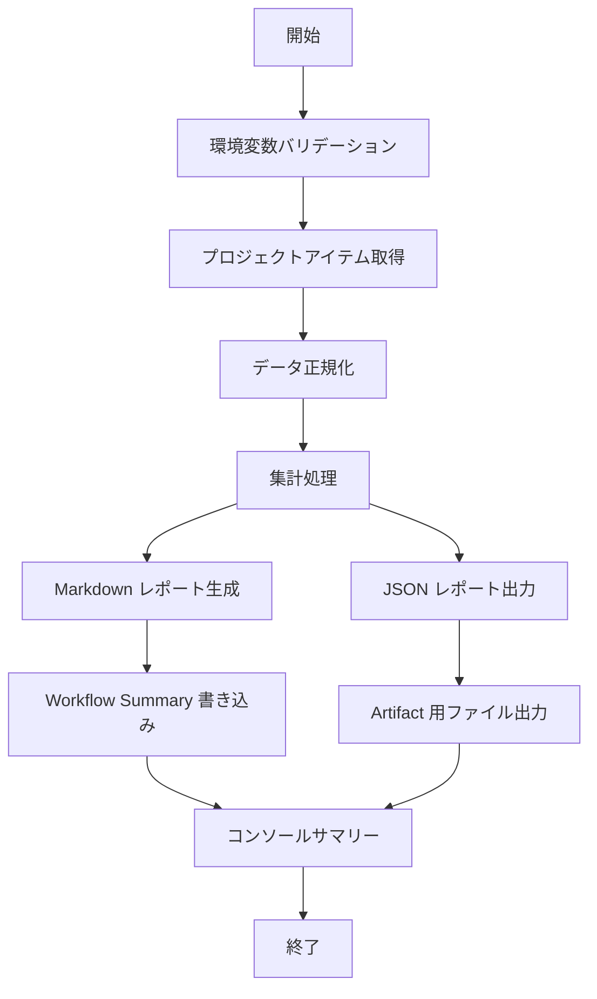

# 📊 プロジェクトサマリーレポートワークフロー仕様書

<!-- START doctoc -->
<!-- END doctoc -->

> **ステータス:** 調査・仕様策定（Issue #190）
> **目的:** プロジェクトのステータス別・担当者別・ラベル別の集計レポートを生成するワークフロー（⑧）の導入

---

## 📋 1. 背景

既存のエクスポートワークフロー（④）は生データの出力に特化しており、集計・可視化の機能がない。
プロジェクトの進捗を定量的に把握できるサマリーレポートがあると、意思決定を支援できる。

## 🔬 2. 調査結果

### 2.1 既存エクスポートスクリプトのデータ構造と再利用可能性

#### 現在取得可能なフィールド（`export-project-items.sh`）

| フィールド | 型 | 説明 |
|---|---|---|
| `type` | String | `Issue` または `PullRequest` |
| `number` | Number | アイテム番号 |
| `title` | String | タイトル |
| `url` | String | GitHub URL |
| `state` | String | `OPEN` / `CLOSED` / `MERGED` |
| `repository` | String | `owner/repo` 形式 |
| `author` | String | 作成者のログイン名 |
| `assignees` | String | アサインされたユーザー（カンマ区切り） |
| `labels` | String | ラベル名（カンマ区切り） |
| `created_at` | DateTime | 作成日時（ISO 8601） |
| `updated_at` | DateTime | 最終更新日時（ISO 8601） |

#### サマリーレポートで追加が必要なフィールド

| フィールド | 所属オブジェクト | 説明 |
|---|---|---|
| `Status` | `ProjectV2ItemFieldSingleSelectValue` | プロジェクトのステータス値（Backlog / Todo / In Progress / In Review / Done） |
| `見積もり工数(h)` | `ProjectV2ItemFieldNumberValue` | カスタムフィールド: 見積もり工数 |
| `実績工数(h)` | `ProjectV2ItemFieldNumberValue` | カスタムフィールド: 実績工数 |
| `終了期日` | `ProjectV2ItemFieldDateValue` | カスタムフィールド: 期日 |

#### 再利用可能性

既存スクリプトの GraphQL クエリとデータ正規化ロジックは直接再利用が難しい。

理由:
- 既存スクリプトはプロジェクトフィールド値（Status 等）を取得していない（`content` のみ取得）
- サマリーレポートにはプロジェクトフィールド値の取得が必須
- 集計処理は新規実装が必要

ただし、以下は共通利用が可能:
- `common.sh` のユーティリティ関数群（バリデーション、GraphQL 実行、ページネーション等）
- 出力フォーマット生成の設計パターン

### 2.2 集計軸の洗い出し

#### 基本集計

| 集計軸 | 説明 | 出力形式 |
|---|---|---|
| **ステータス別件数** | Backlog / Todo / In Progress / In Review / Done 別の件数 | テーブル + Mermaid 円グラフ |
| **タイプ別件数** | Issue / PullRequest 別の件数 | テーブル |
| **状態別件数** | OPEN / CLOSED / MERGED 別の件数 | テーブル |

#### 担当者別集計

| 集計軸 | 説明 | 出力形式 |
|---|---|---|
| **担当者別総件数** | 各担当者に割り当てられたアイテム数 | テーブル |
| **担当者別ステータス分布** | 各担当者のステータス別内訳 | テーブル |
| **未アサインアイテム数** | アサインされていないアイテムの件数 | テーブル内に含む |

#### ラベル別集計

| 集計軸 | 説明 | 出力形式 |
|---|---|---|
| **ラベル別件数** | 各ラベルが付与されたアイテム数 | テーブル |
| **ラベルなしアイテム数** | ラベルが付与されていないアイテムの件数 | テーブル内に含む |

#### カスタムフィールド集計

| 集計軸 | 説明 | 出力形式 |
|---|---|---|
| **見積もり工数合計** | ステータス別の見積もり工数合計 | テーブル |
| **実績工数合計** | ステータス別の実績工数合計 | テーブル |
| **期日超過アイテム** | 終了期日を過ぎた未完了アイテムの一覧 | テーブル |

### 2.3 出力形式の検討

| 方法 | 利点 | 欠点 |
|---|---|---|
| **Workflow Summary** | 追加設定不要、GitHub Actions 標準機能、Mermaid レンダリング対応 | 実行ごとに消える、通知が届かない |
| **Issue コメント** | 履歴が残る、メンション通知が可能 | コメントが蓄積して見づらくなる |
| **専用 Issue 作成** | 実行ごとに独立、検索しやすい | Issue が大量に作成される可能性 |
| **Artifact** | 大量データに対応、ダウンロード可能、後続自動化に活用 | 閲覧に手間がかかる |

**推奨:** Workflow Summary を主出力とし、Artifact（JSON）を補助出力とする。

理由:
- Workflow Summary は GitHub Actions の標準機能で Mermaid のレンダリングにも対応しており、グラフを含むレポートの表示に適している
- 既存ワークフロー（④エクスポート、⑥滞留検知）と同じ出力パターンとなり、一貫性がある
- Artifact に JSON を出力することで、Slack 通知等の後続自動化への拡張が容易
- Issue コメントは将来のオプションとして検討可能

### 2.4 スケジュール実行への対応

| 方式 | 設定例 | 注意点 |
|---|---|---|
| **`schedule`（cron）** | `cron: '0 0 * * 1'`（毎週月曜 UTC 0:00） | UTC 基準、最低間隔はおおよそ 5 分、GitHub の負荷状況により遅延あり |
| **`workflow_dispatch`（手動）** | UI またはAPI から手動実行 | 必要時にオンデマンド実行 |

**推奨:** `workflow_dispatch`（手動実行）のみをトリガーとする。

理由:
- 既存ワークフロー（⑥滞留検知）の方針と統一する
- スケジュール実行は運用開始後に必要に応じて追加可能
- 手動実行のみにすることで、不要な実行を防ぎコスト（Actions 分数）を抑制できる

### 2.5 Mermaid チャートによるグラフ表現

GitHub の Workflow Summary は Mermaid のレンダリングに対応している。

#### 利用可能なグラフ種類

| グラフ | Mermaid 構文 | 用途 |
|---|---|---|
| **円グラフ** | `pie` | ステータス別の比率表示 |
| **棒グラフ** | `xychart-beta` | 担当者別・ラベル別の件数比較 |
| **フローチャート** | `flowchart` | 処理フローの可視化（ドキュメント用） |

#### Mermaid チャート出力例

**ステータス別円グラフ:**



**担当者別棒グラフ:**



**注意事項:**
- Mermaid の `pie` チャートは値が 0 のセクションを非表示にするため、該当ステータスがない場合は自動的に省略される
- `xychart-beta` は GitHub の Mermaid レンダリングで対応しているが、表示が崩れる可能性があるため、テーブルを主として Mermaid は補助表示とする
- ラベル名に特殊文字（`/`、`:`等）が含まれる場合はダブルクォートで囲む必要がある

### 2.6 既存 `common.sh` ユーティリティの活用範囲

| 関数 | 用途 | 活用可否 |
|---|---|---|
| `validate_common_project_env` | 環境変数バリデーション一括実行 | ✅ そのまま利用 |
| `detect_owner_type` | オーナー種別判定 | ✅ `validate_common_project_env` 経由で利用 |
| `apply_owner_field` | GraphQL クエリのオーナーフィールド置換 | ✅ そのまま利用 |
| `run_graphql_paginated` | ページネーション付き GraphQL 実行 | ✅ そのまま利用 |
| `run_graphql_json` | JSON 変数付き GraphQL 実行 | ✅ そのまま利用 |
| `print_summary` | コンソールサマリー出力 | ✅ そのまま利用 |
| `JQ_MD_ESCAPE` | Markdown 特殊文字エスケープ | ✅ Markdown 出力時に利用 |
| `should_include_issues` / `should_include_prs` | アイテムタイプフィルタ | ✅ タイプ別フィルタリングに利用 |
| `validate_enum` | 列挙値バリデーション | ✅ 入力パラメータのバリデーションに利用 |

### 2.7 GraphQL クエリ設計

サマリーレポートではプロジェクトフィールド値の取得が必要なため、既存のエクスポートスクリプトとは異なるクエリが必要。

```graphql
query($login: String!, $number: Int!, $after: String) {
  __OWNER_FIELD__(login: $login) {
    projectV2(number: $number) {
      title
      items(first: 100, after: $after) {
        pageInfo {
          hasNextPage
          endCursor
        }
        nodes {
          fieldValues(first: 20) {
            nodes {
              ... on ProjectV2ItemFieldSingleSelectValue {
                name
                field { ... on ProjectV2FieldCommon { name } }
              }
              ... on ProjectV2ItemFieldNumberValue {
                number
                field { ... on ProjectV2FieldCommon { name } }
              }
              ... on ProjectV2ItemFieldDateValue {
                date
                field { ... on ProjectV2FieldCommon { name } }
              }
            }
          }
          content {
            ... on Issue {
              __typename
              number
              title
              url
              state
              createdAt
              updatedAt
              author { login }
              repository { nameWithOwner }
              assignees(first: 100) { nodes { login } }
              labels(first: 100) { nodes { name } }
            }
            ... on PullRequest {
              __typename
              number
              title
              url
              state
              createdAt
              updatedAt
              author { login }
              repository { nameWithOwner }
              assignees(first: 100) { nodes { login } }
              labels(first: 100) { nodes { name } }
            }
          }
        }
      }
    }
  }
}
```

### 2.8 大規模プロジェクトでの実行性能

| 項目 | 対応策 |
|---|---|
| ページネーション | 既存の `run_graphql_paginated` を使用（100件/ページ、最大50ページ = 5000件） |
| API レート制限 | GraphQL API のレート制限は 5,000 ポイント/時間。`fieldValues` の追加取得によりコスト増加するが、通常運用では問題ない |
| 実行時間 | 1000 アイテムの場合、10 ページ × 約 1-2 秒 = 約 10-20 秒で完了見込み |
| メモリ | jq によるストリーム処理で、集計結果のみをメモリに保持 |

## 📊 3. レポートに含める集計項目の一覧

### 3.1 必須項目

| # | 集計項目 | 説明 |
|---|---|---|
| 1 | **概要サマリー** | 総アイテム数、Issue/PR 別件数、OPEN/CLOSED 別件数 |
| 2 | **ステータス別件数** | 各ステータス（Backlog〜Done）の件数と割合 |
| 3 | **担当者別件数** | 各担当者のアイテム数（未アサイン含む） |
| 4 | **ラベル別件数** | 各ラベルのアイテム数（ラベルなし含む） |

### 3.2 オプション項目（カスタムフィールド使用時）

| # | 集計項目 | 説明 |
|---|---|---|
| 5 | **工数サマリー** | ステータス別の見積もり工数合計・実績工数合計 |
| 6 | **期日超過アイテム** | 終了期日を過ぎた未完了アイテムの一覧 |

> **Note:** カスタムフィールドが設定されていないプロジェクトでは、オプション項目のセクションは自動的に非表示とする。

## 📝 4. 出力フォーマットモックアップ

### 4.1 Workflow Summary（Markdown）

```markdown
# 📊 プロジェクトサマリーレポート

- **Project:** プロジェクト名 (#1)
- **実行日時:** 2026-03-17T09:00:00Z
- **総アイテム数:** 46 件（Issue: 38, PR: 8）

---

## ステータス別

| ステータス | 件数 | 割合 |
|---|---|---|
| Backlog | 10 | 21.7% |
| Todo | 8 | 17.4% |
| In Progress | 5 | 10.9% |
| In Review | 3 | 6.5% |
| Done | 20 | 43.5% |


## 担当者別

| 担当者 | 件数 | In Progress | In Review |
|---|---|---|---|
| user1 | 12 | 3 | 1 |
| user2 | 8 | 1 | 2 |
| user3 | 6 | 1 | 0 |
| (未アサイン) | 20 | 0 | 0 |

## ラベル別

| ラベル | 件数 |
|---|---|
| bug | 12 |
| enhancement | 15 |
| documentation | 5 |
| (ラベルなし) | 14 |

## 工数サマリー

| ステータス | 見積もり工数(h) | 実績工数(h) |
|---|---|---|
| Backlog | 40.0 | - |
| Todo | 32.0 | - |
| In Progress | 24.0 | 16.0 |
| In Review | 12.0 | 10.0 |
| Done | 80.0 | 75.0 |
| **合計** | **188.0** | **101.0** |

## 期日超過アイテム: 2 件

| # | タイトル | ステータス | 担当者 | 終了期日 | 超過日数 |
|---|---------|-----------|--------|---------|---------|
| [#15](url) | タイトル | In Progress | user2 | 2026-03-10 | 7 |
| [#28](url) | タイトル | Todo | user1 | 2026-03-01 | 16 |
```

### 4.2 Artifact（JSON）

```json
{
  "project": {
    "title": "プロジェクト名",
    "number": 1
  },
  "executed_at": "2026-03-17T09:00:00Z",
  "summary": {
    "total": 46,
    "by_type": {
      "Issue": 38,
      "PullRequest": 8
    },
    "by_state": {
      "OPEN": 26,
      "CLOSED": 18,
      "MERGED": 2
    }
  },
  "by_status": [
    { "status": "Backlog", "count": 10, "percentage": 21.7 },
    { "status": "Todo", "count": 8, "percentage": 17.4 },
    { "status": "In Progress", "count": 5, "percentage": 10.9 },
    { "status": "In Review", "count": 3, "percentage": 6.5 },
    { "status": "Done", "count": 20, "percentage": 43.5 }
  ],
  "by_assignee": [
    {
      "assignee": "user1",
      "total": 12,
      "by_status": {
        "Backlog": 2,
        "Todo": 3,
        "In Progress": 3,
        "In Review": 1,
        "Done": 3
      }
    }
  ],
  "by_label": [
    { "label": "bug", "count": 12 },
    { "label": "enhancement", "count": 15 },
    { "label": "documentation", "count": 5 },
    { "label": "(none)", "count": 14 }
  ],
  "effort": {
    "by_status": [
      {
        "status": "Backlog",
        "estimated_hours": 40.0,
        "actual_hours": null
      },
      {
        "status": "In Progress",
        "estimated_hours": 24.0,
        "actual_hours": 16.0
      }
    ],
    "total_estimated": 188.0,
    "total_actual": 101.0
  },
  "overdue_items": [
    {
      "type": "Issue",
      "number": 15,
      "title": "タイトル",
      "url": "https://github.com/...",
      "status": "In Progress",
      "assignees": ["user2"],
      "due_date": "2026-03-10",
      "days_overdue": 7
    }
  ]
}
```

## ⚙️ 5. ワークフロー設計

### 5.1 ワークフロー入力パラメータ

| パラメータ | 必須 | 説明 |
|---|---|---|
| `project-number` | Yes | 対象 Project の Number |

### 5.2 ワークフロー構成

```yaml
name: "⑧ プロジェクトサマリーレポート"

on:
  workflow_dispatch:
    inputs:
      project-number:
        description: "Project の Number"
        required: true

jobs:
  generate-summary-report:
    runs-on: ubuntu-latest
    permissions:
      contents: read
    steps:
      - uses: actions/checkout@v6.0.2
      - name: サマリーレポート生成
        env:
          GH_TOKEN: ${{ secrets.PROJECT_PAT }}
          PROJECT_OWNER: ${{ github.repository_owner }}
          PROJECT_NUMBER: ${{ inputs.project-number }}
        run: |
          chmod +x scripts/generate-summary-report.sh
          bash scripts/generate-summary-report.sh
      - name: Artifact アップロード
        if: always() && hashFiles('report-*.json') != ''
        uses: actions/upload-artifact@v4
        with:
          name: summary-report-${{ inputs.project-number }}
          path: report-*.json
          retention-days: 90

  workflow-summary-failure:
    needs: [generate-summary-report]
    if: failure()
    runs-on: ubuntu-latest
    steps:
      - uses: actions/checkout@v6.0.2
      - uses: ./.github/actions/workflow-summary
        with:
          status: failure
          project-owner: ${{ github.repository_owner }}
          project-number: ${{ inputs.project-number }}
          job-results: |
            {"generate-summary-report": "${{ needs.generate-summary-report.result }}"}

  workflow-summary-success:
    needs: [generate-summary-report]
    if: success()
    runs-on: ubuntu-latest
    steps:
      - uses: actions/checkout@v6.0.2
      - uses: ./.github/actions/workflow-summary
        with:
          status: success
          project-owner: ${{ github.repository_owner }}
          project-number: ${{ inputs.project-number }}
          job-results: |
            {"generate-summary-report": "${{ needs.generate-summary-report.result }}"}
```

### 5.3 スクリプト処理概要

`scripts/generate-summary-report.sh` の処理フロー:

1. 環境変数バリデーション（`validate_common_project_env`）
2. プロジェクトアイテム取得（ページネーション対応、フィールド値を含む）
3. データ正規化（DraftIssue 除外、フィールド値の抽出）
4. 集計処理（ステータス別、担当者別、ラベル別、工数、期日超過）
5. Workflow Summary 用 Markdown 生成（Mermaid チャート含む）
6. Artifact 用 JSON 出力
7. コンソールサマリー出力



## 🚀 6. 今後の拡張候補

- Slack / Teams 通知連携（Artifact JSON を入力として webhook 送信）
- Issue コメントへの自動投稿オプション
- 前回実行との差分表示（トレンドレポート）
- `schedule` トリガーによる週次自動実行
- リポジトリ別の集計セクション追加
