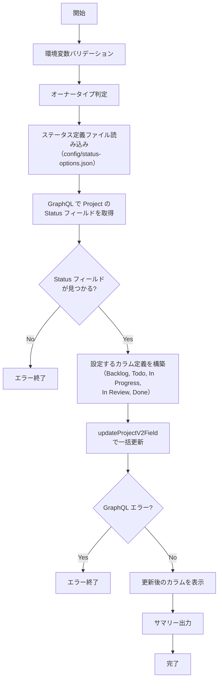

# setup-project-status.sh

Project の Status フィールドにカラムを設定するスクリプトです。
既存の Status フィールドに対して、定義済みのカラムを追加・更新します。

## 環境変数

| 環境変数 | 説明 | 必須 |
|----------|------|:----:|
| `GH_TOKEN` | GitHub PAT（Projects 操作権限が必要） | ✅ |
| `PROJECT_OWNER` | Project の所有者 | ✅ |
| `PROJECT_NUMBER` | 対象 Project の Number（数値） | ✅ |

## 設定されるステータスカラム

ステータスカラム定義は `scripts/config/status-options.json` に外部化されています。
デフォルトでは以下のカラムが設定されます:

| カラム名 | カラー | 説明 | 用途 |
|---------|--------|------|------|
| Backlog | GRAY | バックログ | 優先度未確定・いつかやるタスク |
| Todo | BLUE | 着手予定 | 今スプリントで着手するタスク |
| In Progress | YELLOW | 作業中 | 現在作業中のタスク |
| In Review | ORANGE | レビュー中 | PRレビュー待ち・レビュー中のタスク |
| Done | GREEN | 完了 | 作業完了したタスク |

## 処理フロー

## 処理詳細

| ステップ | 処理内容 | 使用コマンド / API |
|---------|---------|-------------------|
| オーナータイプ判定 | `detect_owner_type` で Organization / User を判別 | `gh api users/{owner}` |
| ステータス定義ファイル読み込み | `scripts/config/status-options.json` からステータスカラム定義を読み込み | `cat` |
| Status フィールド取得 | GraphQL クエリで Project の `SingleSelectField` から `Status` を検索し、Field ID と現在のカラム一覧を取得 | `gh api graphql` — `projectV2.fields(first: 50)` |
| カラム更新 | `singleSelectOptions` に Backlog（GRAY）・Todo（BLUE）・In Progress（YELLOW）・In Review（ORANGE）・Done（GREEN）を指定して一括更新 | `gh api graphql` — `updateProjectV2Field` mutation |
| サマリー出力 | カラム構成（`Backlog → Todo → In Progress → In Review → Done`）をコンソールと `GITHUB_STEP_SUMMARY` に出力 | — |

## API リファレンス

| API / コマンド | 用途 | リファレンス |
|---------------|------|-------------|
| `ProjectV2SingleSelectField` (GraphQL) | Status フィールド情報の取得 | [ProjectV2SingleSelectField](https://docs.github.com/en/graphql/reference/objects#projectv2singleselectfield) |
| `updateProjectV2Field` (GraphQL Mutation) | ステータスカラムの一括更新 | [updateProjectV2Field](https://docs.github.com/en/graphql/reference/mutations#updateprojectv2field) |

### パラメータ上限

| パラメータ | 現在の値 | 備考 |
|-----------|---------|------|
| `fields(first: N)` | 50 | Status フィールド検索用（ビルトイン＋カスタムフィールドを取得） |

## 使用ワークフロー

- [① GitHub Project 新規作成](../workflows/01-create-project)
- [② GitHub Project 拡張](../workflows/02-extend-project)
