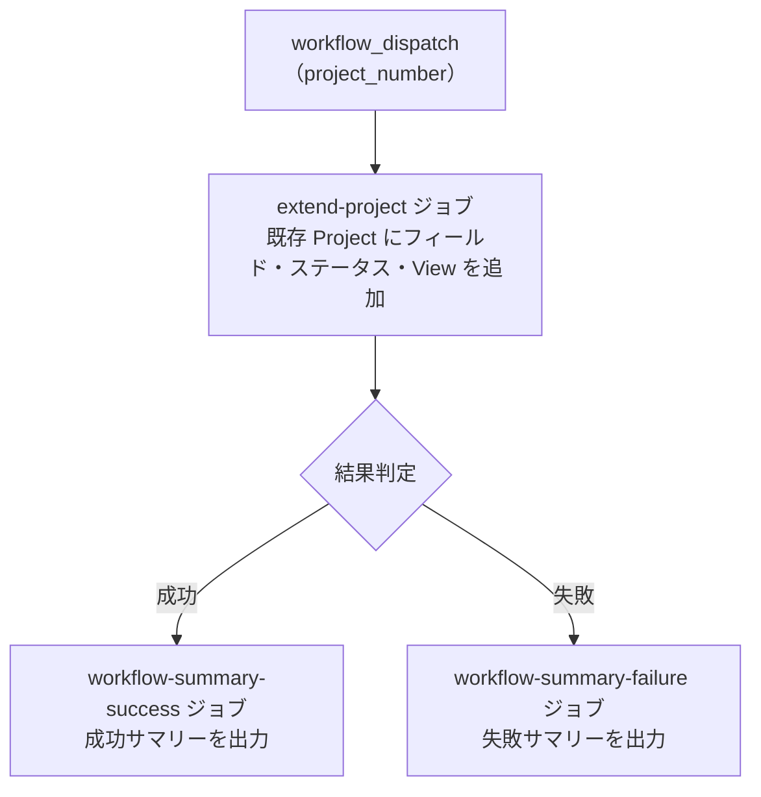

# ② 🔧 GitHub Project 拡張

既存の `Project` にカスタムフィールド・ステータスカラム・`View` を追加します。
[① GitHub Project 新規作成](01-create-project) を実行していない既存 `Project` 向けです。

<!-- START doctoc generated TOC please keep comment here to allow auto update -->
<!-- END doctoc generated TOC please keep comment here to allow auto update -->

## ✅ 前提

このワークフローを実行する前に、クイックスタートを完了してください。

- [クイックスタート（GUI）](../quickstart-gui)
- [クイックスタート（CLI）](../quickstart-cli)

## 📖 使い方

1. `Actions` タブを開く
2. `② GitHub Project 拡張` を選択
3. `Run workflow` をクリック
4. パラメータを入力して実行

## ⚙️ パラメータ

| パラメータ | 説明 | 必須 | タイプ | 例 |
|------------|------|:----:|--------|-----|
| `project_number` | 対象 `Project` の Number | ✅ | `number` | `1` |

## 📊 処理フロー



## 🔧 ワークフロー仕様

### ファイル

`.github/workflows/02-extend-project.yml`

### トリガー

`workflow_dispatch`（手動実行）

### 環境変数

| 環境変数 | ソース | 説明 |
|----------|--------|------|
| `GH_TOKEN` | `secrets.PROJECT_PAT` | GitHub PAT（Projects 操作権限） |
| `PROJECT_OWNER` | `github.repository_owner` | Project オーナー |
| `PROJECT_NUMBER` | `inputs.project_number` | 対象 Project Number |

> **Note:** 環境変数は再利用ワークフロー `_reusable-extend-project.yml` 内で設定されます。

### ジョブ構成

```
.github/workflows/02-extend-project.yml
  ├── extend-project ジョブ
  │   └── _reusable-extend-project.yml             # フィールド・ステータス・View セットアップ
  │       ├── scripts/setup-project-status.sh      # ステータスカラム設定
  │       ├── scripts/setup-project-fields.sh      # カスタムフィールド作成
  │       └── scripts/setup-project-views.sh       # View 作成
  ├── workflow-summary-failure ジョブ（失敗時）
  │   └── .github/actions/workflow-summary         # 失敗サマリー出力
  └── workflow-summary-success ジョブ（成功時）
      └── .github/actions/workflow-summary         # 成功サマリー出力
```

## 📜 関連スクリプト

- [setup-project-status.sh](../scripts/setup-project-status) — ステータスカラム設定スクリプト
- [setup-project-fields.sh](../scripts/setup-project-fields) — カスタムフィールド作成スクリプト
- [setup-project-views.sh](../scripts/setup-project-views) — View 作成スクリプト
